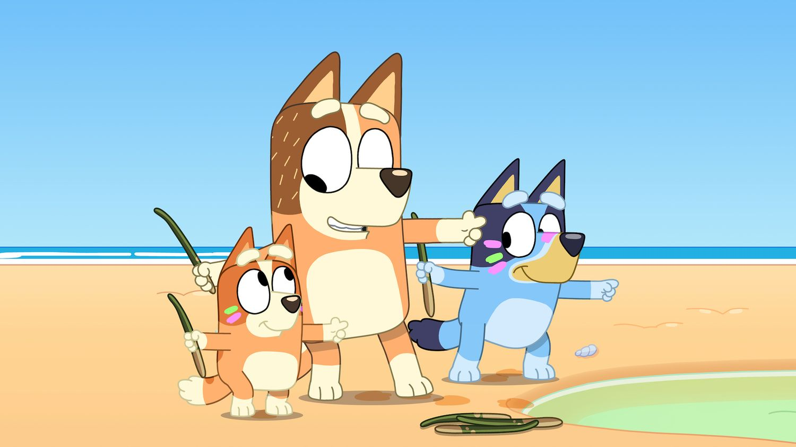

  
  <h1>snufflesrea - Audit Portfolio</h1>
  
<strong>Web3 Security Researcher Specialized in Rust/Solana. </strong>

## About me

I was a wellhead Engineer have a career break and turned into Android Developer. Now I am venturing into web3 space and
breaking code in my spare time

## Contests highlights

| Metric | Value |
| --- | --- |
| Total bugs found | 1 |
| Critical found | 0 |
| Highs found | 0  |
| Mediums found | 1 |
| Top-10 placements | 0 |

## Private engagements highlights

| Metric | Value |
| --- | --- |
| Total bugs found | 0 |
| Criticals found | 0 |
| Highs found | 0 |
| Mediums found | 0 |
| Lows found | 0 |

### Public Contests

Short summaries and links live in `public/`. Add a row for each contest.

| Date | Duration | Contest | Platform | Result | Findings |
| --- | --- | --- | --- | --- | --- |
| 2025-12-17 | 30d | Rujira | Code4rena |  | [1M](public/2025-12-Rujira.md) |

### Private Audits

| Date | Duration  | NSLOC | Project | Type  | Findings |
| --- | --- | --- | --- | --- | --- |

## Notes

- Private reports are shared with client permission only.
- Public contest summaries include direct links to platform findings.
