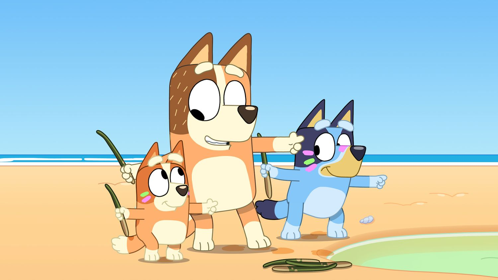

  

  <h1>snufflesrea — Web3 Security Researcher</h1>

  

    Rust & Solana Security · DeFi · Smart Contract Auditing
  

## About Me

Former Android developer who transitioned into Web3 security.

I specialize in auditing Rust/Solana protocols and learn by breaking real systems. My current focus is DeFi protocol security, with an expanding focus on zero-knowledge and privacy protocols.

## At a Glance

- 🦀 Rust / Solana security researcher
- 🏆 1 High and 2 Medium findings from public audit contests
- 🔍 3 valid findings across competitive audits
- 🏅 Top 30 finish in Code4rena competition
- 🧠 Currently exploring ZK and privacy protocol security

## Security Focus

- Rust and Anchor programs
- Solana account models and PDA security
- DeFi protocols
- AMMs and lending protocols
- Access control and authorization
- State/account validation
- Economic vulnerabilities

## Public Audit Contests

| Date | Contest | Platform | Result | Findings |
| --- | --- | --- | --- | --- |
| Dec 2025 | Rujira | Code4rena | #53 | [1 Medium](public/2025-12-Rujira-C4.md) |
| Apr 2026 | K2 Lend | Code4rena | #29 | [1 High, 1 Medium](public/2026-4-K2-C4.md) |

## Private Audits

Private audit work is available upon request, subject to client confidentiality.

## Publication & Media

## Contact

[X](https://x.com/snufflesrea) | [Email](mailto:andrealiureta@gmail.com)

## Notes

- Private reports are shared with client permission only.
- Public contest summaries include links to platform findings.
